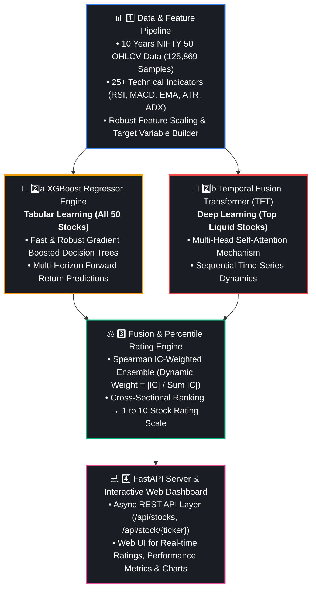
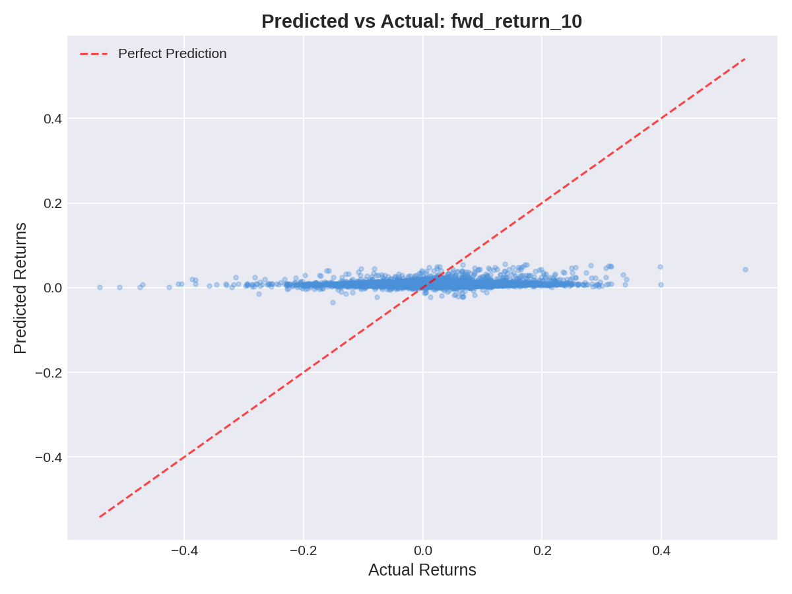
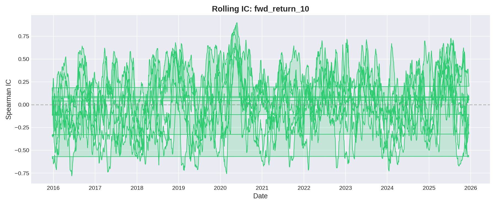
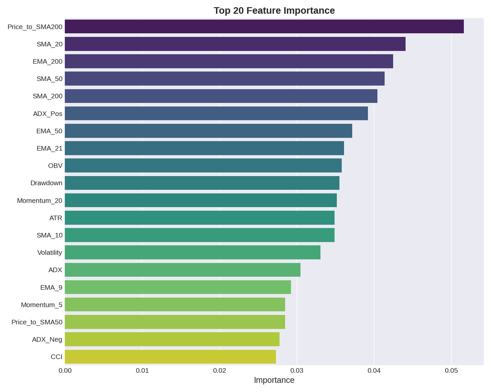
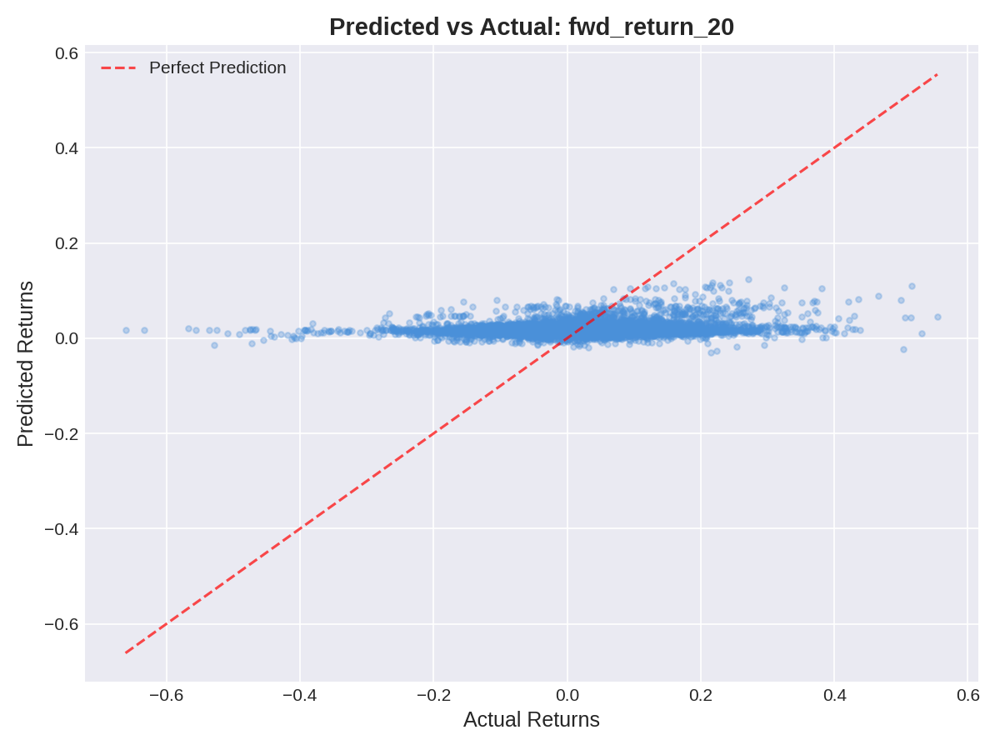
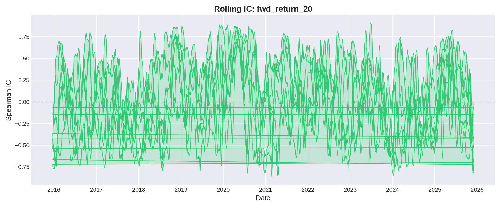
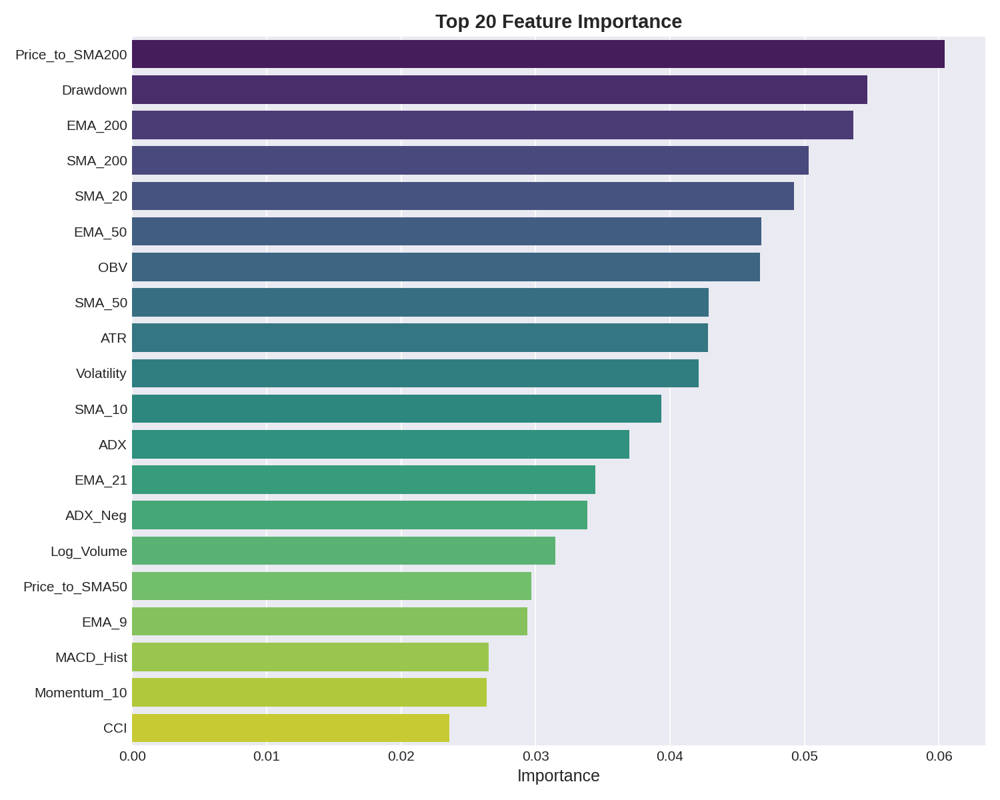
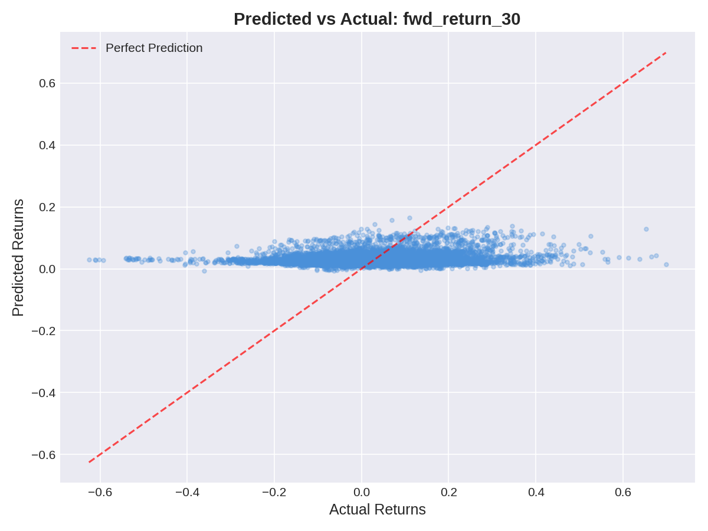
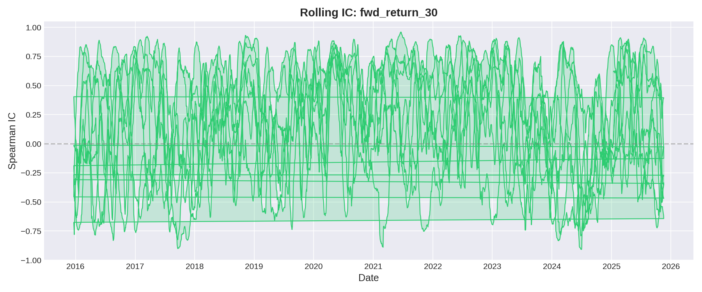
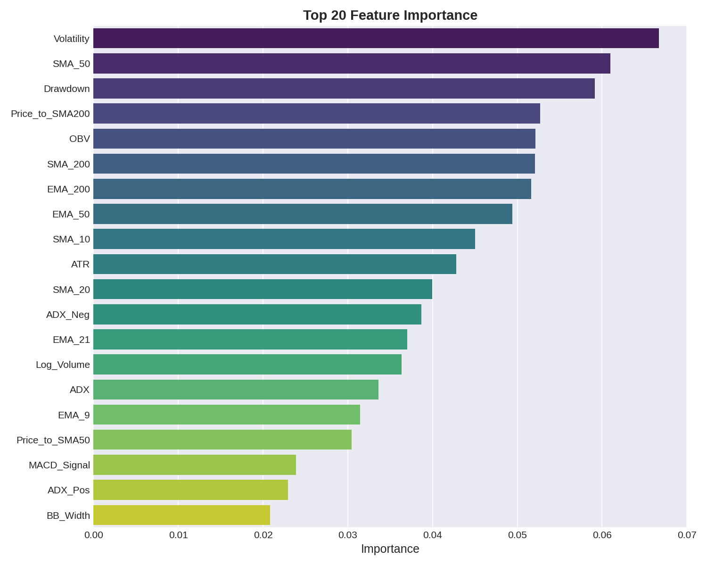

# 📈 NIFTY 50 Stock Rating System

<div align="center">


**An intelligent end-to-end stock forecasting and percentile rating platform for India's NIFTY 50 equities.**  
Combines tabular Gradient Boosting (**XGBoost**) and multi-horizon time-series deep learning (**Temporal Fusion Transformer**) via dynamic **Spearman Information Coefficient (IC)** dynamic weighting.

[Explore Features](#-features) • [Installation](#-getting-started) • [Model Results](#-evaluation--performance-charts) • [Learnings](#-what-i-learned--key-takeaways) • [API Dashboard](#-web-dashboard--api)

</div>

---

## 📌 About The Project

Predicting financial markets is notoriously hard due to low signal-to-noise ratios and changing market regimes. Standard single-model approaches often fail because stock returns behave differently over short (10-day), medium (20-day), and long (30-day) horizons.

I built the **NIFTY 50 Stock Rating System** to solve two core problems:
1. **Multi-Horizon Return Forecasting**: Instead of predicting just the next day, predicting forward returns over 10-day, 20-day, and 30-day windows to serve different trading strategies (swing trading to position holding).
2. **Hybrid Ensemble Strategy**: Utilizing **XGBoost** for fast, robust tabular learning across all 50 NIFTY equities, alongside a **Temporal Fusion Transformer (TFT)** to capture complex sequential temporal patterns on key liquid stocks.

Rather than relying on raw return percentages which can be difficult for traders to interpret quickly, the pipeline converts ensemble forecasts into intuitive **1 to 10 ratings** based on cross-sectional percentile ranks.

---

## ⚡ Features

- 📊 **10 Years of Market Data**: Processed 125,000+ daily OHLCV samples across 50 Indian NIFTY blue-chip stocks (2015 – 2025).
- 🧮 **25+ Technical Indicators**: Automated feature extraction including RSI, MACD, Bollinger Bands, ATR, ADX, Stochastic Oscillator, OBV, Volume Z-Scores, and Drawdown stats.
- 🎯 **Multi-Horizon Targets**: Simultaneously predicts `fwd_return_10`, `fwd_return_20`, and `fwd_return_30`.
- 🤖 **Dual-Engine Architecture**:
  - **XGBoost**: Trained on the full 50-stock universe for fast, scalable feature-based predictions.
  - **Temporal Fusion Transformer (TFT)**: Deep learning model leveraging self-attention and LSTM gates for sequence forecasting.
- ⚖️ **Dynamic IC Weighting**: Combines predictions by dynamically weighting models based on their rolling 60-day Spearman Rank Correlation (Information Coefficient).
- 🏷️ **1-10 Percentile Rating Scale**: Translates model outputs into actionable 1–10 scores (e.g., 9-10 = Strong Buy, 1-2 = Strong Sell).
- 💻 **Interactive Web Dashboard**: Built with FastAPI and vanilla frontend to monitor ratings, charts, and API endpoints live.

---

## 🛠️ Tech Stack & Tools

| Domain | Tool / Library | Usage |
| :--- | :--- | :--- |
| **Language** | Python 3.11 | Core runtime environment |
| **Tabular ML** | `xgboost`, `scikit-learn` | Gradient boosted decision trees & scaling |
| **Deep Learning** | `pytorch`, `pytorch-lightning`, `darts` | Temporal Fusion Transformer implementation |
| **Hyperparameter Tuning** | `optuna` | Automated hyperparameter optimization |
| **Data Processing** | `pandas`, `numpy`, `pyarrow` | High-performance tabular data handling & Parquet storage |
| **Backend & Web** | `fastapi`, `uvicorn`, `pydantic` | Async REST API & interactive dashboard server |
| **Visualization** | `matplotlib`, `seaborn` | Evaluation charts & feature importance generation |

---

## 🏗️ Architecture & Pipeline Flow



---

## 📊 Evaluation & Performance Charts

The system was evaluated across out-of-sample test data for 10-day, 20-day, and 30-day forecast horizons. Key evaluation metrics recorded during pipeline runs:

### 📈 Metrics Summary Table

| Forecast Horizon | Target Variable | RMSE ↓ | Directional Accuracy ↑ | Spearman IC (Rank Correlation) ↑ |
| :--- | :--- | :--- | :--- | :--- |
| **10-Day Forward** | `fwd_return_10` | **0.062419** | **54.95%** | **0.068024** |
| **20-Day Forward** | `fwd_return_20` | **0.087826** | **56.95%** | **0.076888** |
| **30-Day Forward** | `fwd_return_30` | **0.107848** | **58.73%** | **0.083988** |

> **Key takeaway**: In quantitative finance, a directional accuracy of **55% – 58%** with a positive Spearman IC (> 0.05) provides a statistically meaningful edge over random guessing, particularly when combined with percentile rating rules.

---

### 🖼️ Diagnostic Charts & Feature Importances

#### 1️⃣ 10-Day Return Horizon (`fwd_return_10`)
| Scatter Plot (Predicted vs Actual) | Rolling Information Coefficient (IC) | Top Feature Importance |
| :---: | :---: | :---: |
|  |  |  |

#### 2️⃣ 20-Day Return Horizon (`fwd_return_20`)
| Scatter Plot (Predicted vs Actual) | Rolling Information Coefficient (IC) | Top Feature Importance |
| :---: | :---: | :---: |
|  |  |  |

#### 3️⃣ 30-Day Return Horizon (`fwd_return_30`)
| Scatter Plot (Predicted vs Actual) | Rolling Information Coefficient (IC) | Top Feature Importance |
| :---: | :---: | :---: |
|  |  |  |

---

## 🧠 What I Learned & Key Takeaways

Building this system end-to-end taught me several crucial lessons in applied Machine Learning, Time-Series Analysis, and Software Engineering:

### 1. **Financial Markets Have Low Signal-to-Noise Ratios**
Unlike image classification where 99% accuracy is common, stock price returns contain high noise. A directional accuracy of 55%-58% is realistic and strong in quant trading. Expecting 80%+ accuracy on raw return prediction usually signals data leakage or overfitting.

### 2. **Multi-Horizon Learning Prevents Single-Frame Bias**
Model performance varies by forecast duration. I learned that longer windows (30-day) tend to show higher directional accuracy (58.7%) and Spearman IC (0.084) because noise smooths out over multi-week periods, allowing underlying trend signals to dominate.

### 3. **Dynamic IC-Weighting Outperforms Simple Averaging**
Simply averaging model outputs gives equal weight to a model even when its performance drops. Using 60-day rolling **Spearman Rank Correlation (IC)** to weight models dynamically ensures that whichever model currently captures market dynamics gets greater influence in the final rating.

### 4. **Scalability vs Complexity Trade-off**
Training complex deep learning architectures like TFT on 50 stocks simultaneously requires heavy memory and compute. Scaling XGBoost across all 50 stocks for breadth while reserving TFT for top stocks gave the optimal balance between speed and temporal attention modeling.

### 5. **Robust Preprocessing Matters More Than Model Complexity**
Using `RobustScaler` (which uses medians and interquartile ranges) was essential to prevent extreme volatility spikes during market crashes/rallies from distorting feature distributions.

---

## 🚀 Getting Started

Follow these steps to set up and run the system on your local machine.

### Prerequisites
- **Python 3.11+** installed
- **8 GB+ RAM** (16 GB recommended)
- Git installed

### 1. Clone & Environment Setup
```bash
# Clone the repository
git clone https://github.com/your-username/Nifty_50-stock-rating-system.git
cd Nifty_50-stock-rating-system

# Create a virtual environment
python -m venv venv

# Activate virtual environment
# Windows:
venv\Scripts\activate
# Linux/macOS:
source venv/bin/activate

# Install dependencies
pip install -r requirements.txt
```

### 2. Run Pipeline Steps
Run the numbered scripts sequentially to fetch data, build features, train models, ensemble predictions, and generate evaluation charts:

```bash
# Step 1: Download 10 years of OHLCV stock data
python -m scripts.01_fetch_data

# Step 2: Compute technical indicators & targets
python -m scripts.02_build_features

# Step 3: Train XGBoost models for 10d, 20d, 30d horizons
python -m scripts.03_train_xgboost

# Step 4: Train Temporal Fusion Transformer (TFT)
python -m scripts.04_train_tft

# Step 5: Run IC-weighted ensemble & generate 1-10 stock ratings
python -m scripts.05_ensemble_rate

# Step 6: Compute evaluation metrics and generate performance plots
python -m scripts.06_evaluate
```

---

## 🔌 Web Dashboard & API

Once the pipeline has generated models and ratings, launch the interactive dashboard server:

```bash
uvicorn app.api:app --reload --port 8000
```

- 🌐 **Web UI Dashboard**: Open [http://localhost:8000](http://localhost:8000) in your browser.
- 📖 **API Docs (Swagger)**: Access [http://localhost:8000/docs](http://localhost:8000/docs) to test API endpoints interactively.

### Key API Endpoints
- `GET /api/stocks` — Fetch latest ratings for all NIFTY 50 stocks.
- `GET /api/stock/{ticker}` — Get detailed metrics, indicators, and ratings for a single stock.
- `GET /api/model/accuracy` — View current model accuracy metrics across horizons.

---

## 📁 Project Structure

```
Nifty_50-stock-rating-system/
├── config.yaml                   # Central configuration file for all parameters
├── requirements.txt              # Project dependencies
├── README.md                     # Documentation & setup guide
│
├── src/                          # Modular core package
│   ├── data/                     # Data fetching and loading utilities
│   ├── features/                 # Technical indicators and feature builder
│   ├── models/                   # XGBoost, TFT, and Ensemble engine
│   ├── rating/                   # Percentile-based 1-10 rating logic
│   ├── evaluation/               # Metric evaluators and visualization scripts
│   └── utils/                    # Logger and configuration loader
│
├── scripts/                      # Executable pipeline stages
│   ├── 01_fetch_data.py          # Downloads stock history via yfinance
│   ├── 02_build_features.py      # Computes indicators & targets
│   ├── 03_train_xgboost.py       # Fits XGBoost regressors
│   ├── 04_train_tft.py           # Fits PyTorch TFT model
│   ├── 05_ensemble_rate.py       # Combines outputs & outputs stock ratings
│   └── 06_evaluate.py            # Evaluates performance & generates charts
│
├── app/                          # Web server & Frontend UI
│   ├── api.py                    # FastAPI application routes
│   └── static/                   # HTML/CSS/JS frontend dashboard
│
├── data/                         # Data directory (raw, processed, predictions)
├── models/                       # Checkpoints & serialized model artifacts
└── outputs/                      # Generated evaluation charts & CSV tables
    ├── charts/                   # Saved evaluation plots (scatter, IC, feature imp)
    └── tables/                   # Stock rating CSV exports
```

---

## ⚙️ Key Configuration (`config.yaml`)

All parameters are centrally managed in `config.yaml`:
- Data date range (default: `2015-01-01` to `2025-12-31`)
- Technical indicator parameters (EMA windows, RSI lookback, MACD spans)
- Model hyperparameters (XGBoost `n_estimators`, `max_depth`, `learning_rate`; TFT hidden size, attention heads)
- Ensemble lookback window for IC calculation (default: 60 days)

---

## 📜 License & Acknowledgments

- Released under the **MIT License**.
- Market data sourced via `yfinance`.
- Special thanks to open-source contributors of PyTorch, Darts, XGBoost, and FastAPI.
